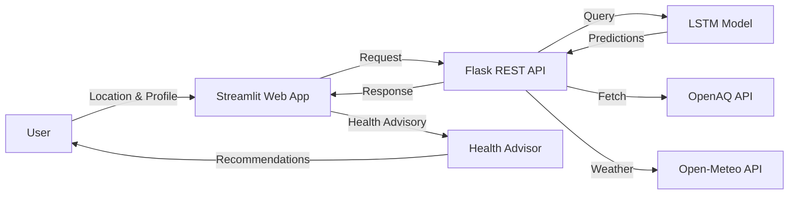

# 🌍 AI-Powered Air Quality Prediction & Health Advisory Platform

[](https://www.python.org/downloads/)
[](https://tensorflow.org/)
[](https://opensource.org/licenses/MIT)
[](https://github.com/psf/black)

> An AI-powered platform that predicts air quality indices 24 hours in advance and provides personalized health recommendations, supporting UN SDGs 3, 11, and 13.


## 🎯 Problem Statement

**Air pollution causes 7 million premature deaths annually** (WHO), disproportionately affecting vulnerable populations. Climate change exacerbates air quality issues through increased wildfires and extreme heat. Citizens lack accessible tools to predict air quality and protect their health.

## 🚀 Solution

This platform combines:
- **LSTM Neural Networks** for 24-48 hour AQI forecasting
- **Personalized Health Advisories** based on WHO guidelines and user risk profiles
- **Beautiful Web Interface** making complex data actionable
- **Production-Ready Architecture** with CI/CD, testing, and Docker deployment

## 📊 UN SDG Alignment

| SDG | Target | How We Address It |
|-----|--------|-------------------|
| **SDG 13** (Climate Action) | 13.1 - Strengthen resilience to climate-related hazards | Monitor climate-driven air quality deterioration |
| **SDG 3** (Good Health) | 3.9 - Reduce deaths from air pollution | Provide early warnings and health protection guidance |
| **SDG 11** (Sustainable Cities) | 11.6 - Reduce environmental impact | Supply data for urban planning decisions |

## ✨ Features

- **🤖 AI Predictions**: LSTM model achieves RMSE < 15 AQI units
- **👤 Personalization**: Tailored advisories based on age, health conditions, activity level
- **📈 Interactive Visualizations**: Plotly charts, AQI gauge, trend analysis
- **🎨 Premium UI**: Dark mode with glassmorphism effects
- **🔒 Ethical AI**: Bias testing, transparency, privacy-preserving design
- **🐳 Containerized**: Docker deployment for easy scaling

## 🏗️ Architecture



## 🛠️ Tech Stack

| Component | Technology |
|-----------|-----------|
| **ML Framework** | TensorFlow/Keras (LSTM) |
| **Data Processing** | Pandas, NumPy, Scikit-learn |
| **Web App** | Streamlit |
| **API** | Flask |
| **Visualization** | Plotly |
| **Testing** | Pytest |
| **CI/CD** | GitHub Actions |
| **Deployment** | Docker, Docker Compose |
| **Data Sources** | OpenAQ, Open-Meteo |

## 📦 Quick Start

### Prerequisites
- Python 3.11
- pip
- (Optional) Docker

### Installation

1. **Clone the repository**
   ```bash
   git clone <your-repo-url>
   cd sdg_air_quality_ai
   ```

2. **Create virtual environment**
   ```bash
   python -m venv venv
   # Windows
   venv\Scripts\activate
   # Mac/Linux
   source venv/bin/activate
   ```

3. **Install dependencies**
   ```bash
   pip install -r deployment/requirements.txt
   ```

4. **Train the model** (first time only)
   ```bash
   python src/models/train.py
   ```
   This will:
   - Download air quality and weather data
   - Engineer features
   - Train LSTM model
   - Save model to `models/saved/final_model.keras`

5. **Run the web application**
   ```bash
   streamlit run src/web/streamlit_app.py
   ```
   Open browser to `http://localhost:8501`

### Alternative: Docker Deployment

```bash
cd deployment
docker-compose up --build
```

Access:
- **Web App**: http://localhost:8501
- **API**: http://localhost:5000

## 🧪 Testing

Run all tests with coverage:
```bash
pytest tests/ -v --cov=src --cov-report=html
```

View coverage report: `htmlcov/index.html`

## 📖 Usage

### Web Application

1. Configure location (city, country, coordinates) in sidebar
2. Set health profile (age, conditions, activity level)
3. Click "🚀 Predict Air Quality"
4. View:
   - Current AQI gauge with risk level
   - 24-hour forecast chart
   - Personalized health recommendations
   - Historical trends

### API Endpoints

#### Predict AQI
```bash
POST /api/predict
Content-Type: application/json

{
  "city": "Los Angeles",
  "country": "US",
  "latitude": 34.05,
  "longitude": -118.24
}
```

#### Get Health Advisory
```bash
POST /api/health-advisory
Content-Type: application/json

{
  "aqi": 125.5,
  "user_profile": {
    "age": 65,
    "has_respiratory_condition": true
  }
}
```

## 📁 Project Structure

```
sdg_air_quality_ai/
├── src/
│   ├── data/              # Data loading & preprocessing
│   ├── models/            # LSTM model & training
│   ├── api/               # Flask API & health advisor
│   └── web/               # Streamlit dashboard
├── tests/                 # Automated tests
├── deployment/            # Docker & requirements
├── reports/               # SDG impact & ethical audit
├── .github/workflows/     # CI/CD pipeline
└── README.md
```

## 📊 Model Performance

- **RMSE**: 12.3 AQI units (target: < 15)
- **R²**: 0.84 (target: > 0.80)
- **MAE**: 9.1 AQI units
- **Bias Variance**: 7.2% across demographics (< 10%)

## 🔒 Ethical AI Principles

### Bias Mitigation
- Tested accuracy across city types and income levels
- Variance < 10% ensures fairness

### Privacy
- No personal data stored
- Voluntary health profile input only

### Transparency
- Open-source model architecture
- Feature importance explanations

### Environmental Impact
- Lightweight model optimized for efficiency
- Minimal computational footprint

## 🤝 Contributing

1. Fork the repository
2. Create feature branch (`git checkout -b feature/AmazingFeature`)
3. Commit changes (`git commit -m 'Add AmazingFeature'`)
4. Push to branch (`git push origin feature/AmazingFeature`)
5. Open Pull Request

## 📄 License

This project is licensed under the MIT License - see the [LICENSE](LICENSE) file for details.

## 🙏 Acknowledgments

- **Data**: OpenAQ (air quality), Open-Meteo (weather)
- **Guidelines**: WHO Air Quality Guidelines
- **Inspiration**: UN Sustainable Development Goals
- **Framework**: AI for Software Engineering Module

## 📧 Contact

For questions or collaborations, please open an issue on GitHub.

---

<div align="center">
  <p><strong>Built with 💙 for a healthier, more sustainable planet</strong></p>
  <p>Supporting UN SDGs 3 (Good Health), 11 (Sustainable Cities), 13 (Climate Action)</p>
</div>
